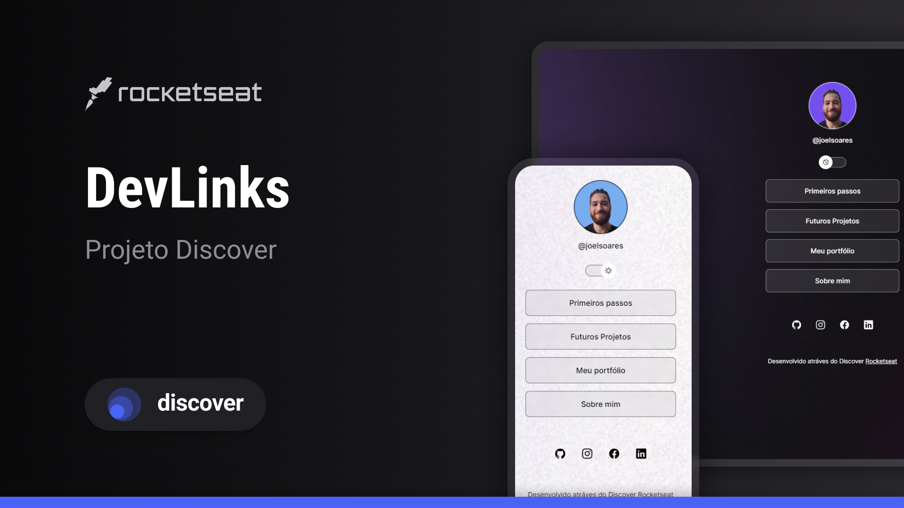

<h1 align="center"> DevLinks </h1>

  <a href="#-tecnologias">Tecnologias</a>&nbsp;&nbsp;&nbsp;|&nbsp;&nbsp;&nbsp;
  <a href="#-projeto">Projeto</a>&nbsp;&nbsp;&nbsp;|&nbsp;&nbsp;&nbsp;
  <a href="#-layout">Layout</a>&nbsp;&nbsp;&nbsp;

  

 

  

## 💻 Projeto

O DevLinks é um agregador de links para usar como cartão de visitas online. É o meu primeiro projeto desenvolvido através do curso Discover pela Rocketseat onde tive meus primeiros contatos e conhecimentos com as tecnologias para Desenvolvimento WEB.

## 🚀 Tecnologias

Esse projeto foi desenvolvido com as seguintes tecnologias:

- HTML e CSS
- JavaScript
- Git e Github
- Figma

## 🔖 Layout

Você pode visualizar o layout do projeto através [desse link](https://www.figma.com/community/file/1187422022288947321). É necessário ter conta no [Figma](https://figma.com) para acessá-lo.

---

 
  Feito com ♥ by Joel Soares

